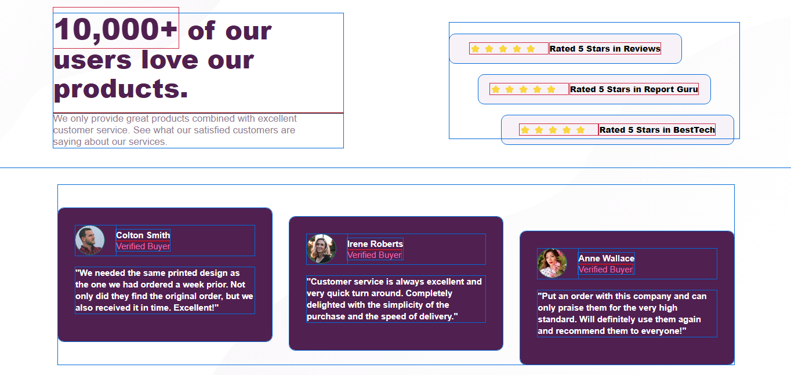

## Table of contents

- [Overview](#overview)
  - [The challenge](#the-challenge)
  - [Screenshot](#screenshot)
  - [Links](#links)
- [My process](#my-process)
  - [Built with](#built-with)
  - [What I learned](#what-i-learned)
  - [Continued development](#continued-development)
- [Author](#author)

## Overview

This is a solution to the [Social proof section challenge on Frontend Mentor](https://www.frontendmentor.io/challenges/social-proof-section-6e0qTv_bA).

### The challenge

Users should be able to:

- View the optimal layout for the section depending on their device's screen size

### Screenshot

### Links

- Solution URL: [Add solution URL here](https://your-solution-url.com)
- Live Site URL: [Add live site URL here](https://your-live-site-url.com)

## My process

### Built with

- Semantic HTML5 markup
- CSS custom properties
- Flexbox
- CSS Grid

### What I learned

Well did'nt anything new but this project made me solidify my grid and flexbox prowess

### Continued development

So if you noticed it is'nt responsive yet .
Well i tried writing a responsive code for it but it was quite difficult, messy and and a lot of stress.
I think it the way i wrote the HTML so am going to come back very soon and remodel this site 

## Author
- Frontend Mentor - [@iceberg61](https://www.frontendmentor.io/profile/iceberg61)
- Twitter - [@ayanakoji-kiyo](https://www.twitter.com/ayanakoji-kiyo)
